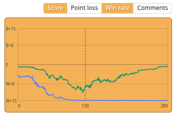
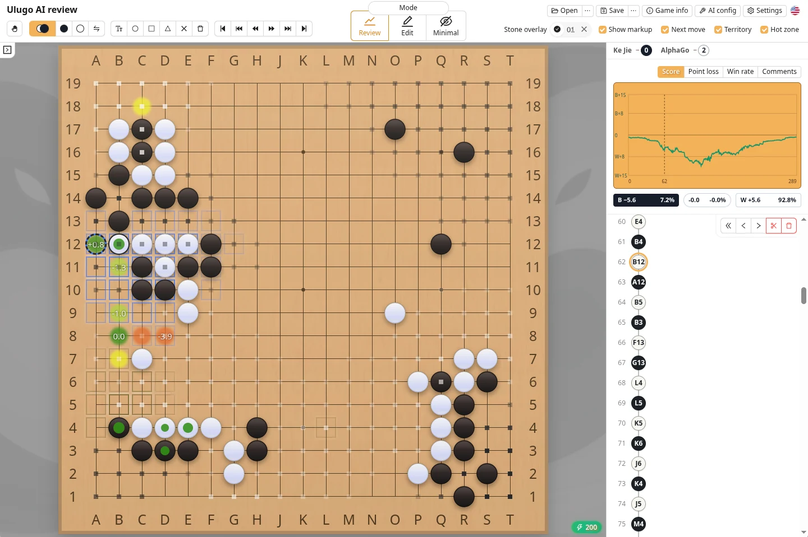

The Ulugo desktop app analyzes games locally and displays top moves, territory, score, and win-rate changes. AI analysis is not available in the web app.

Ulugo prepares the AI runtime automatically on first use. See [Runtime and Hardware Setup](./katago.html) for configuration details.

### Start Analysis

After opening a game record, click the lightning button at the bottom-right of the board or press `Space`:

- Ulugo first scans the existing moves at low visits to build the full-game charts;
- Analysis then continues on the current position, and the result stabilizes as the search progresses;
- Completed nodes are cached and do not need to be analyzed again when revisited;
- Press `Space` again to stop analysis.

Hold `Shift` while clicking the analysis button, or press `Shift + Space`, to start **Deep analysis**. It continues searching the current position and is useful for comparing complex variations.

### Top Moves

Top moves are candidate moves from the current search. The circles show their order; **Top move overlay** in Settings can also display the following values:

| Option | Description |
| --- | --- |
| Score change | Estimated score change relative to the best candidate. `0` is the baseline; `-3.0` means a loss of about 3 points |
| Win-rate change | Win-rate change relative to the best candidate. `0%` is the baseline; negative values indicate a loss in win rate |
| Score | Estimated final score after the move, from the current player's perspective; positive means ahead and negative means behind |
| Visits | Search visits allocated to the candidate, reflecting search allocation and result stability rather than move quality alone |
| Value | The value of the move relative to passing. It is similar to, but not identical to, gote endgame value |

Top move overlay can show up to two values at once. **Minimal visit to show top move overlay** hides candidates whose search is still too limited for stable values.

Press `Enter` to play the current best move. See [Shortcuts and Gestures](./shortcut.html) for more controls.

### Principal Variation

Hover over a top move to preview the AI's expected continuation on the board. `Alt`-clicking a top move shows the same preview.

**Principal variation preview delay** controls how long you must hover before the sequence appears. Setting it to `0` disables hover previews but does not disable `Alt`-click.

The principal variation is the main line from the current search, not the only possible continuation. It may change as the search continues.

### Charts

The right panel provides three charts, which can be displayed separately or together:

| Chart | Description |
| --- | --- |
| Score | Estimated final score after each move, including komi and the current rules. The area above the center line is `B+`; below it is `W+` |
| Point loss | Estimated score lost by the played move. Taller bars indicate larger losses; changes above about 1 point are highlighted |
| Win rate | Black's estimated win rate after each move. White's win rate is `100% − Black's win rate`, with `50%` as the even-game baseline |

Hover over a chart to view the move number, score, both players' win rates, and point loss. Click to jump directly to that move, or use the mouse wheel over the chart to move backward and forward.

In a game with a large lead, win rate may stay close to `0%` or `100%` for a long time. Score and point loss are usually more informative for comparing individual moves in that situation.

### Territory and Hot Zone

| Display | Description |
| --- | --- |
| Territory | Semi-transparent colors show the areas each side is expected to control. This is the current analysis estimate, not a confirmed final score |
| Hot zone | Blue marks key areas contested by both sides or vulnerable after a mistake. Gray marks areas that may need to be sacrificed to preserve something more important |

### If Analysis Is Slow

First try reducing the visits used for normal analysis or the full-game scan. For models, hardware, and runtime settings, see [Runtime and Hardware Setup](./katago.html).
