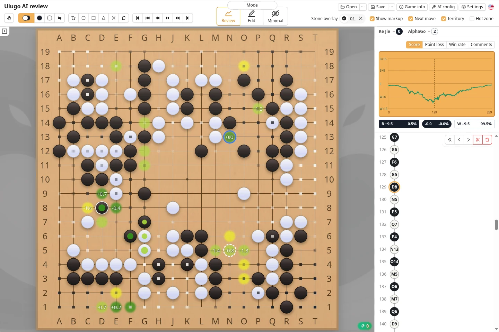
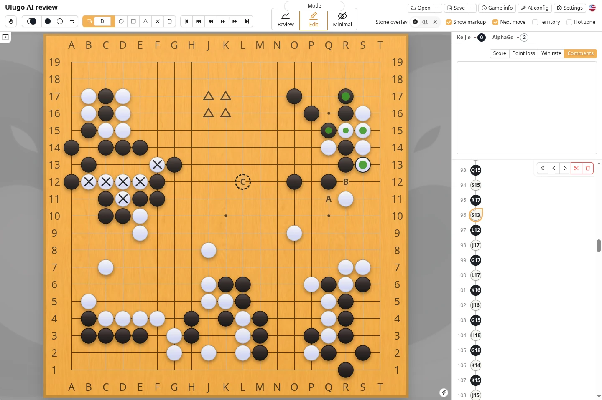
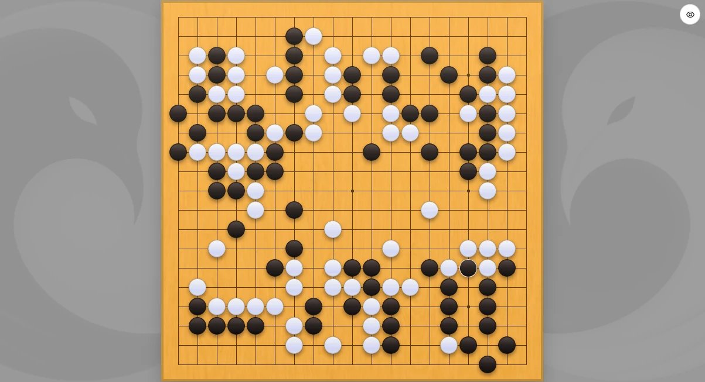

Ulugo is a Go game record editor and offline AI review tool. You can record games in a browser, edit SGF files, import board positions from photos, and score finished games. The desktop app also provides local AI analysis.

| Version | Best for |
| --- | --- |
| [Web app](https://ulugo.com) | Recording and editing games, Minimal mode, image recognition, and post-game scoring—no installation required |
| [Desktop app](https://github.com/rinick/ulugo/releases/latest) | Everything in the web app, plus local AI analysis |

### Review Mode

Review mode displays AI-recommended moves, territory, score, and win-rate changes. Use it after a game to identify mistakes and compare variations. AI analysis is available only in the desktop app; see [AI Analysis](./analysis.html) for details.

### Edit Mode

Edit mode is designed for creating and organizing game records:

- Open, edit, and save SGF files;
- Add variations, comments, and board markup;
- Correct misrecorded moves and reorder variations;
- Recognize a board position from a photo and create an SGF file.

For photo import and post-game scoring, see [Board Image Recognition](./scan.html). For common keyboard and mouse actions, see [Shortcuts and Gestures](./shortcut.html).

For move-by-move recording, periodic photo updates, or correcting an earlier misrecorded move, see [Game Recording](./record.html).

### Minimal Mode

Minimal mode hides most of the interface so the board can fill as much of the window as possible. It is especially useful for [recording games](./record.html) on a phone or tablet. The round button in the upper-right corner provides temporary access to move numbers, coordinates, basic tools, and the right panel.

### Feature Index

| Feature | Documentation |
| --- | --- |
| Record move by move, continue from photos, or correct a misrecorded move | [Game Recording](./record.html) |
| Import a board from a photo or score a finished game | [Board Image Recognition](./scan.html) |
| Review a game with AI | [AI Analysis](./analysis.html) |
| Configure the AI runtime or troubleshoot performance | [Runtime and Hardware Setup](./katago.html) |
| View or change keyboard shortcuts | [Shortcuts and Gestures](./shortcut.html) |
