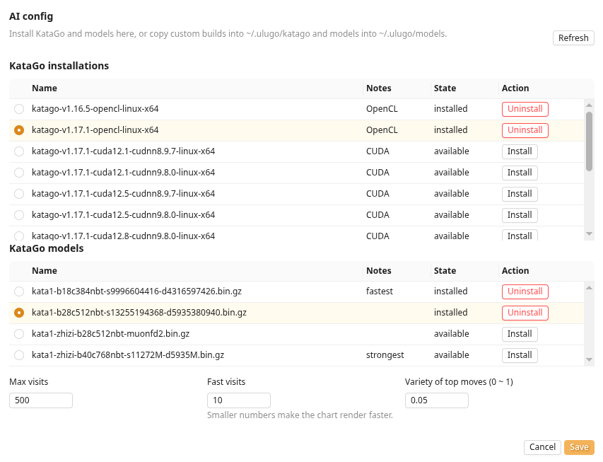

KataGo is an open-source Go engine without its own graphical interface. The Ulugo desktop app runs it locally to obtain candidate moves, territory, score, and other analysis data, then presents the results in its review interface.

On first use, Ulugo automatically installs and selects a recommended KataGo build and model. Most users do not need to configure them manually. Once setup is complete, see [AI Analysis](./analysis.html) for usage.

### KataGo and Models

AI analysis requires two components:

| Component | Purpose |
| --- | --- |
| KataGo | The program that runs analysis on your computer |
| Model | A neural-network file containing the engine's learned playing strength and evaluation |

Both run locally. An internet connection is required for the initial download; after installation, game records can be analyzed offline.

### Hardware Requirements

KataGo can use a GPU or run on the CPU alone. A GPU is not required, but it usually makes analysis significantly faster.

| Computer | Recommended option |
| --- | --- |
| Recent discrete or integrated GPU | Try `OpenCL` first; it supports a broad range of hardware |
| Recent NVIDIA GPU, with compatible drivers and runtimes | Try `TensorRT` or `CUDA` |
| No suitable GPU, but the CPU supports AVX2 | Select `CPU` |
| Older CPU without AVX2 | Select `Old CPU`; analysis will be slower |
| macOS | Installation uses Homebrew; Apple Silicon uses a suitable system build |

Larger models and more concurrent analysis generally require more memory. If memory is limited or analysis is slow, start with a model marked **fastest**. Reserve at least a few hundred MB of disk space; installing several models requires more.

For backend details, see the [official KataGo documentation](https://github.com/lightvector/KataGo#opencl-vs-cuda-vs-tensorrt-vs-eigen).

### Automatic Setup and Manual Selection

On first launch, Ulugo downloads and selects a recommended runtime build and model. Keep the network connection available during the download; analysis works offline afterward.

To try another build or model, open **AI config**:

1. Under **KataGo installations**, choose and install a build suitable for your computer;
2. Under **KataGo models**, install and select a model;
3. Click **Save**, then return to the board and start analysis.

Some GPU builds run performance tuning the first time they start. The interface may respond slowly during this process; it normally does not need to run again after completion.

### Common Settings

| Setting | Description |
| --- | --- |
| Max visits | Search budget for normal analysis of the current position; higher values are generally more stable but slower |
| Fast visits | Search budget per move during the full-game scan; lower values make the charts available sooner |
| Variety of top moves | Increases candidate diversity; `0` is the most stable, while higher values spread the candidates more widely |
| Current installation | Switch between installed KataGo builds or models, and uninstall items no longer needed |

### Startup or Performance Problems

- Try `OpenCL` first; if the GPU or driver is incompatible, switch to `CPU`;
- `CUDA` and `TensorRT` builds for NVIDIA GPUs require compatible drivers and runtime libraries;
- Select a smaller model marked **fastest**;
- Reduce **Fast visits** and **Max visits**;
- Open the console in the left panel to inspect the error message.

If the issue persists, open an [Ulugo GitHub issue](https://github.com/rinick/ulugo/issues/new) and include your operating system, CPU/GPU model, selected build, and console error. KataGo documentation and release notes are available in the [official repository](https://github.com/lightvector/KataGo).
