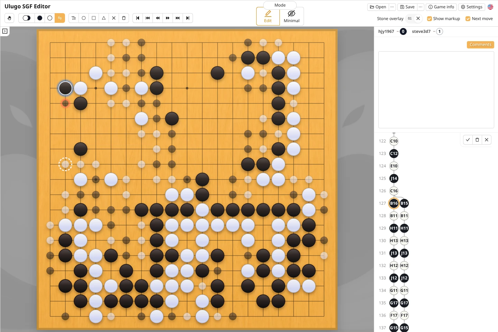
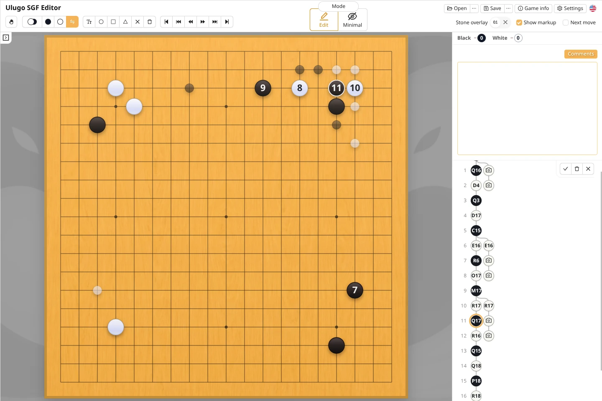

Ulugo can record a game move by move as it is played. You can also photograph the board periodically with a phone, first record the difference between two positions as a board setup node, and later convert those stones into regular moves in their actual order.

### Recording move by move

After starting a new game, use the **Auto play** tool to place each move on the board in sequence.

On a phone or tablet, Minimal mode lets the board occupy as much of the screen as possible. The round button in the upper-right corner temporarily opens move numbers, coordinates, basic tools, and the move tree.

### Correcting an earlier move

If you discover that an earlier move was recorded at the wrong point, you do not need to delete and replay every later stone:

1. Select the incorrect move in the move tree. You can also hold `Shift` and click a stone on the board to jump to its move;
2. Select the **Replace move** tool. Ulugo returns to the position before the incorrect move;
3. Left-click the correct point to replace the next move. Later moves that remain legal are preserved and shown as translucent stones on the board;
   - Newly added moves are marked with a blue shadow, while replaced moves are marked with a red shadow;
   - To insert a missing move before the next move instead of replacing it, place the stone with a right-click;
   - In the **Replace move** tool, the delete button removes only the current move;
4. After checking the result, click ✓ or press `Enter` to confirm;
   - Click X or press `Esc` to discard replacement mode and restore the original board state.

### Recording with photos

Photo recording is useful when you cannot continuously operate the screen but can photograph a physical board from time to time. This entry is currently available only in the mobile web version.

This feature works only on the main branch of the game record.

### Converting a board setup into regular moves

After a photo is added to the game record, you can keep its photographed-position node temporarily. If you know the actual order of play, you can use **Replace move** mode to convert it into regular moves.

When you confirm, the photographed-position node immediately following the new moves is deleted.
