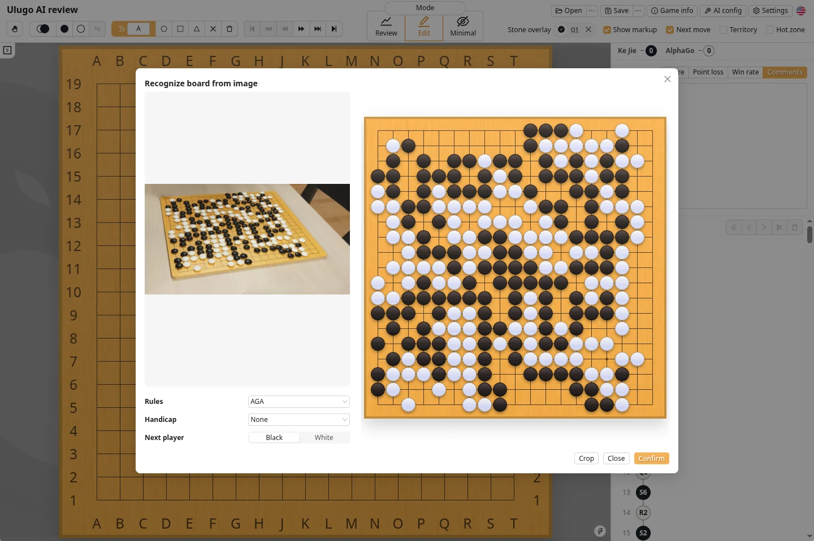
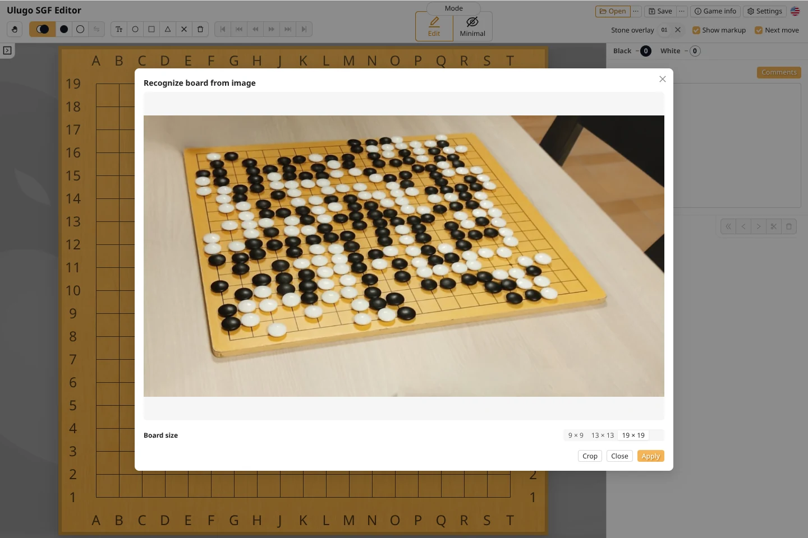
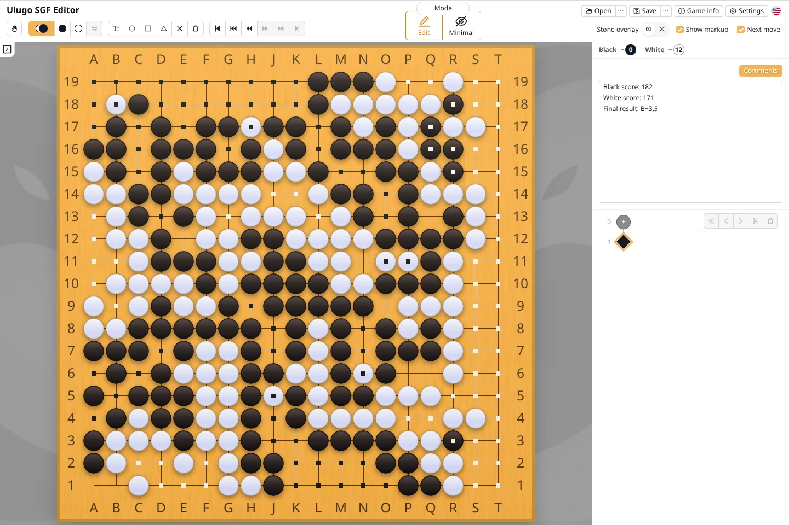
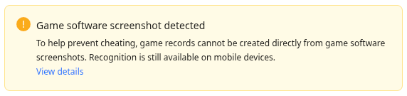

Ulugo can recognize black and white stones from a photo of a Go board, allowing you to **capture a position quickly** or **score a finished game from a photo**. Both workflows are available in the web app; scoring does not require the desktop AI.

A single photo records only the **current position**. It cannot reconstruct the earlier move order or captured stones.

### Quick Start

1. Open an image at [ulugo.com](https://ulugo.com). On a phone, you can also choose **Open from camera**.
2. Select `9 × 9`, `13 × 13`, or `19 × 19`, and crop the image if necessary.
3. Click **Apply** and compare the recognized position with the original image.
4. Select the game rules and confirm. You can then save the SGF or view the scoring result.

### Take a Clear Photo

| Recommended | Avoid |
| --- | --- |
| Include all four sides and corners of the board | Cropped or obstructed board edges |
| Shoot from directly above, or close to it | A low angle with heavy perspective distortion |
| Use even lighting with clear stone edges | Strong reflections on stones or large shadows |
| Keep the image sharp and let the board fill most of the frame | Blur, obstruction, or a board that is too small in the image |

### Crop the Image

Cropping can help when the board occupies only a small part of the photo or the surrounding background is complex. Keep two points in mind:

- Preserve all four sides and corners of the board;
- Do not place the crop boundary directly on the outermost grid line, even if the first line contains no stones.

### Score a Finished Game from a Photo

After the game, open [ulugo.com](https://ulugo.com) on your phone, photograph the complete board, and finish recognition to view the scoring result. Scoring is performed in the browser.

- Select the rules used for the game;
- Compare the recognized board with the photo for missing or incorrect stones;
- If necessary, click dead stones on the board to adjust the result.

### Fair Use and Game Software Screenshots {#screenshot}

Ulugo's image recognition is intended for recording physical boards, scoring finished games, and post-game review. To support fair online play, desktop environments detect common screenshots from Go clients and prevent game records from being created directly from those images.

This mechanism does not attempt to infer the user's intent. It simply adds a lightweight restriction in situations that could affect a live game.

For post-game review of an online game, if the SGF cannot be downloaded and a photo is the only option, use [ulugo.com](https://ulugo.com) on a mobile device to recognize the image and export an SGF. Ulugo does not perform screenshot detection on mobile devices.

### Privacy and Issue Reports

Image recognition runs on your device. Selected images are never uploaded to a server, and we neither collect them nor use them to train any model.

If recognition produces a clear error, please open a [GitHub issue](https://github.com/rinick/ulugo/issues/new). You can decide whether to attach the original image.
