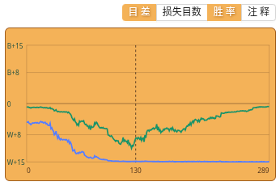
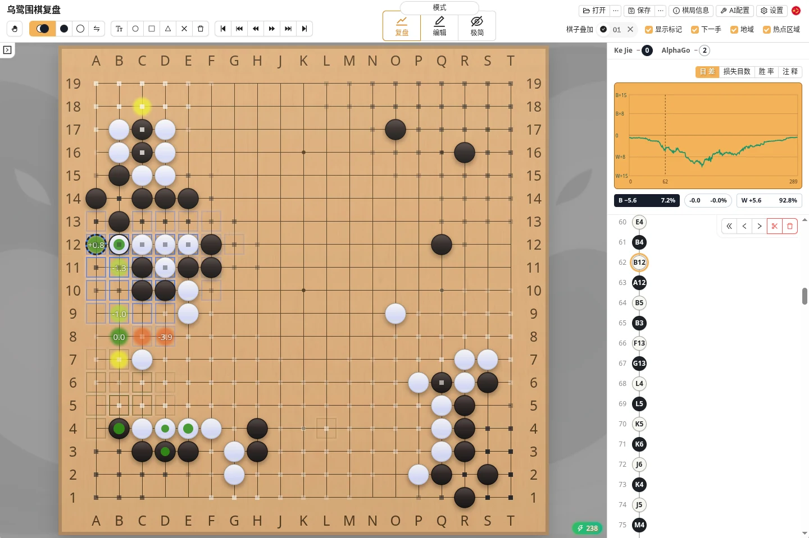

乌鹭桌面版可以在本机分析棋谱，显示推荐点、地域、目差和胜率变化。网页版不提供这项功能。

第一次使用前，需要先完成一次 [AI运行环境配置](./katago.html)。

### 开始分析

打开棋谱后，点击棋盘右下角的闪电按钮，或按 `Space`：

- 乌鹭会先快速扫描已有着手，用来生成整盘图表；
- 当前局面会继续分析，结果会随着计算逐渐稳定；
- 已完成的节点会缓存，再次经过时无需重新计算；
- 再按一次 `Space` 可以停止分析。

按住 `Shift` 点击分析按钮，或按 `Shift + Space`，可以开启**深度分析**。它会持续计算当前局面，适合认真比较复杂变化。

### 推荐点

推荐点按当前搜索结果列出候选着手。圆点用于比较候选顺序；设置中的“推荐点叠加”还可以显示以下数值：

| 选项 | 说明 |
| --- | --- |
| 目差变化 | 相对最佳候选的预计目差变化。`0` 为基准，`-3.0` 表示约损失 3 目 |
| 胜率变化 | 相对最佳候选的胜率变化。`0%` 为基准，负值表示胜率损失 |
| 目差 | 落子后的预计终局目差，以当前行棋方为视角；正值领先，负值落后 |
| 访问数 | 该候选获得的搜索次数，反映搜索资源分配与结果稳定程度，不直接等价于候选质量 |
| 价值 | 这一手棋的价值（相对于停一手的价值）。和后手官子价值相似但不完全等价 |

推荐点叠加最多可以同时选择两项。还可以设置“显示推荐点叠加的最少访问数”，隐藏分析不足、数值仍不稳定的候选点。

按 `Enter` 可以直接落下当前最佳推荐手。更多键位见 [快捷操作](./shortcut.html)。

### 主要变化

将鼠标停在推荐点上，会在棋盘上预览 AI 预计的后续手顺。按住 `Alt` 点击推荐点也可以达到同样效果。

“主要变化预览延迟”用于控制悬停多久后出现变化图；设为 `0` 会关闭悬停预览，但不会关闭 `Alt` 点击。

主要变化是当前搜索给出的主线，并非唯一后续；随着搜索继续，主线也可能改变。

### 右侧图表

右侧面板可以分别打开以下三种图表，也可以同时显示：

| 图表 | 说明 |
| --- | --- |
| 目差 | 每手之后的预计终局目差，包含贴目和当前规则。曲线上方为 `B+`，下方为 `W+` |
| 损失目数 | 实战着手造成的预计目差损失；竖线越长，损失越大，超过约 1 目的变化会被突出显示 |
| 胜率 | 每手之后黑方的预计胜率；白方胜率为 `100% − 黑方胜率`，`50%` 为均衡基准 |

鼠标移到图表上可以查看对应手数的目差、双方胜率和本手损失；点击图表可以直接跳到该手。也可以在图表上滚动鼠标滚轮查看前后手。

对于已经明显领先或落后的棋局，胜率可能长期接近 `0%` 或 `100%`，这时目差和损失目数通常更适合判断每一手的质量。

### 地域与热点区域

| 显示 | 含义 |
| --- | --- |
| 地域 | 棋盘上的半透明颜色表示双方预计控制的区域；这是当前分析的判断，不是已经确认的终局数子结果 |
| 热点区域 | 蓝色表示双方正在争夺、失误后可能失去的关键区域；灰色表示为了保住关键区域，可能需要放弃的部分 |

### 分析较慢时

可以先降低普通分析或整盘扫描的计算量。模型、硬件和运行设置请查看 [运行环境与硬件配置](./katago.html)。
