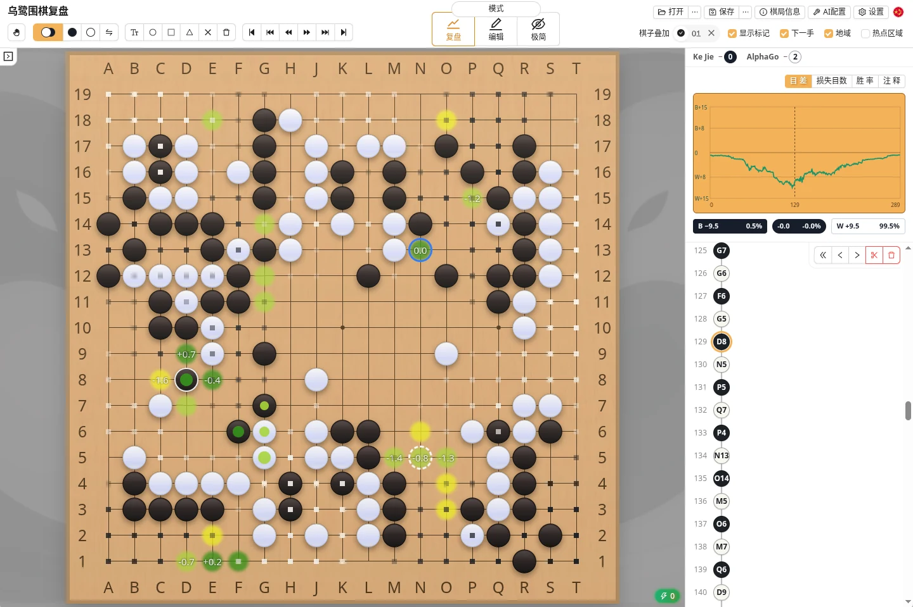
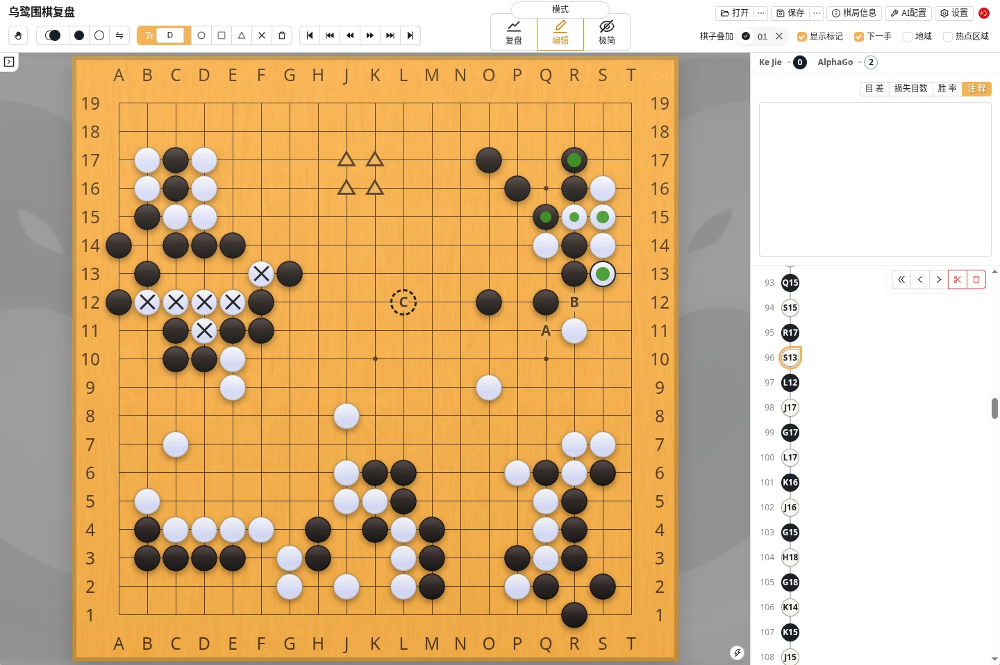

乌鹭围棋（Ulugo）是一款围棋棋谱编辑与离线 AI 复盘工具。你可以在浏览器中记谱、编辑 SGF、拍照录入盘面和盘后数子，也可以在桌面版中进行本地 AI 分析。

| 版本 | 适合做什么 |
| --- | --- |
| [网页版](https://ulugo.com) | 记谱、编辑、极简模式、图像识别和盘后数子，无需安装 |
| [桌面版](https://github.com/rinick/ulugo/releases/latest) | 包含网页版功能，并支持本地 AI 分析 |

### 复盘模式

复盘模式会显示 AI 推荐点、地域、目差和胜率变化，适合赛后寻找失误与比较变化图。AI 分析只在桌面版提供，使用方法见 [AI分析](./analysis.html)。

### 编辑模式

编辑模式用于创建和整理棋谱：

- 打开、编辑和保存 SGF；
- 添加分支、评论及棋盘标记；
- 替换错记的着手，调整分支顺序；
- 从照片识别盘面并生成棋谱。

需要从照片录谱或盘后数子时，请查看 [棋谱图像识别](./scan.html)。常用操作也可以参考 [快捷操作](./shortcut.html)。

### 极简模式

极简模式会隐藏大部分界面，让棋盘尽可能占满窗口，适合面对面记谱或在手机、平板上使用。右上角的圆形按钮可以临时打开手数、坐标、基础工具和右侧面板。

### 功能索引

| 功能 | 相关文档 |
| --- | --- |
| 拍照录入棋盘或盘后数子 | [棋谱图像识别](./scan.html) |
| 用 AI 复盘棋局 | [AI分析](./analysis.html) |
| 配置 AI 运行环境或解决性能问题 | [运行环境与硬件配置](./katago.html) |
| 查看或修改快捷键 | [快捷操作](./shortcut.html) |
| 查看应用内的操作提示 | [小贴士](./tips.html) |
| 了解开源范围、许可证与第三方项目 | [许可证与致谢](./license.html) |
