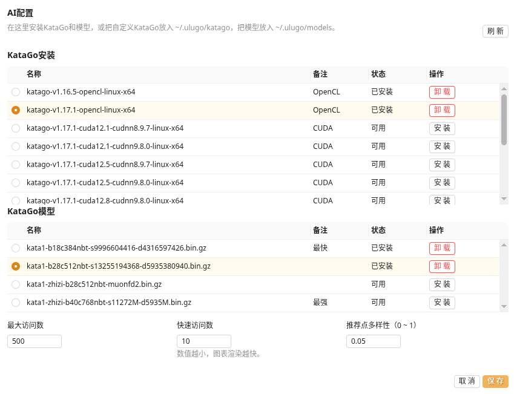

KataGo 是一个开源围棋引擎，本身不带图形界面。乌鹭桌面版在本机调用它，获得候选着手、地域和目数等数据，再将结果整理成易读的复盘界面。

首次使用桌面版时，乌鹭会自动安装并选择推荐的 KataGo 和模型，大多数用户无需手动配置。准备完成后，请前往 [AI分析](./analysis.html) 查看具体使用方法。

### KataGo与模型

AI 分析需要两部分：

| 组件 | 作用 |
| --- | --- |
| KataGo | 负责在电脑上执行分析的程序 |
| 模型 | 保存棋力和判断能力的神经网络文件 |

两者都在本机运行。安装时需要联网下载，安装完成后可以离线分析棋谱。

### 硬件需求

KataGo 可以使用 GPU，也可以只使用 CPU。GPU 不是硬性要求，但通常能明显加快分析。

| 电脑情况 | 建议选择 |
| --- | --- |
| 有较新的独立或集成显卡 | 优先尝试 `OpenCL`，兼容范围较广 |
| 较新的 NVIDIA 显卡，并且熟悉驱动与运行库 | 可以尝试 `TensorRT` 或 `CUDA` |
| 没有合适的 GPU，CPU 支持 AVX2 | 选择 `CPU` |
| 较旧、不支持 AVX2 的 CPU | 选择 `旧CPU`，速度会更慢 |
| macOS | 通过 Homebrew 安装，Apple Silicon 会使用适合系统的构建 |

模型越大、同时分析的内容越多，占用的内存通常也越高。如果电脑内存紧张或分析很慢，可以先选择标记为“最快”的模型。磁盘中建议至少预留数百 MB；安装多个模型时需要更多空间。

更详细的后端说明可以查看 [KataGo 官方文档](https://github.com/lightvector/KataGo#opencl-vs-cuda-vs-tensorrt-vs-eigen)。

### 自动配置与手动更换

首次运行时，乌鹭会自动下载并选择推荐的运行版本和模型。下载过程中需要保持网络连接，完成后即可离线分析。

如果需要尝试其他版本或模型，可以打开“AI配置”：

1. 在“KataGo安装”中选择一个适合电脑的版本并安装；
2. 在“KataGo模型”中安装并选中一个模型；
3. 点击“保存”，回到棋盘开始分析。

第一次启动某些 GPU 版本时，程序可能会进行一次性能调优。这段时间界面响应会比较慢，完成后通常不需要重复运行。

### 常用设置

| 设置 | 作用 |
| --- | --- |
| 最大访问数 | 普通分析当前局面的计算量；越高通常越稳定，也越慢 |
| 快速访问数 | 棋谱每一手用于生成整盘图表的计算量；调低可以更快完成扫描 |
| 推荐点多样性 | 增加候选着手的变化；`0` 最稳定，数值越大候选越分散 |
| 当前安装 | 可以切换已安装的 KataGo 版本或模型，也可以卸载不用的项目 |

### 无法启动或速度很慢

- 首先尝试 `OpenCL`；如果显卡或驱动不兼容，改用 `CPU`；
- NVIDIA 的 `CUDA` 和 `TensorRT` 版本需要匹配的驱动及运行库；
- 选择较小、标记为“最快”的模型；
- 降低“快速访问数”和“最大访问数”；
- 打开左侧控制台查看具体错误信息。

仍无法解决时，可以在 [Ulugo GitHub Issues](https://github.com/rinick/ulugo/issues/new) 中附上系统、CPU/GPU 型号、所选版本和控制台错误。KataGo 本身的说明与更新记录位于 [官方仓库](https://github.com/lightvector/KataGo)。
