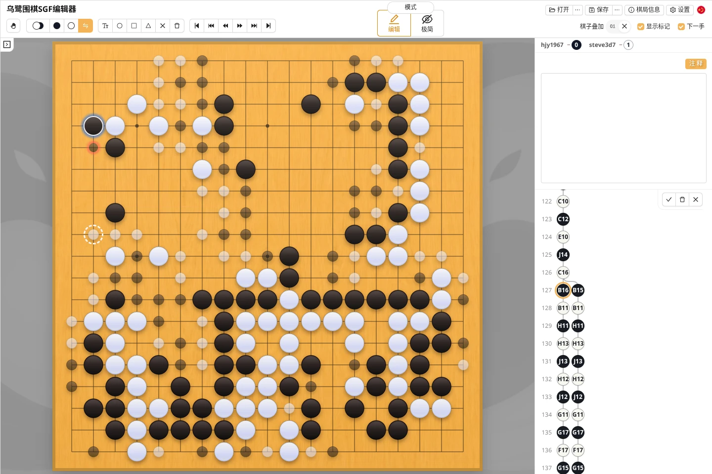
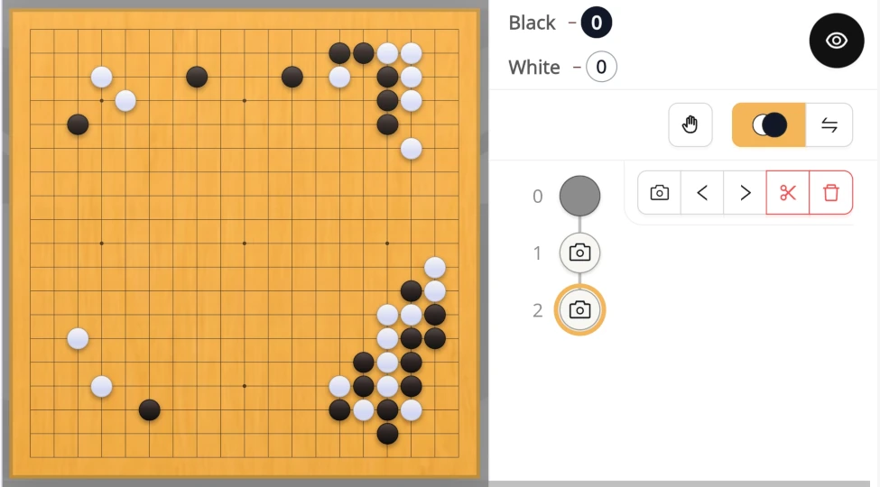
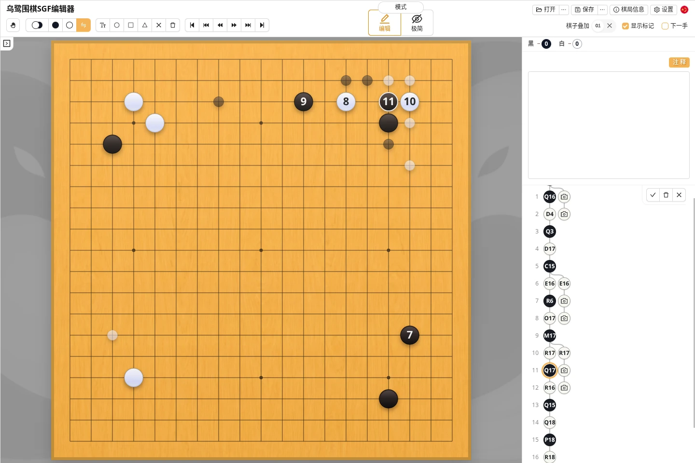

乌鹭围棋既可以在对局过程中逐手记谱，也可以用手机定期拍摄棋盘，将两次盘面之间的差别先记录为盘面设置节点，之后再按实际顺序转换成普通着手。

### 逐手记谱

开始一盘新棋后，使用“黑白交替”工具在棋盘上依次落子。

在手机或平板上，可以使用极简模式让棋盘尽量占满屏幕。右上角的圆形按钮可以临时打开手数、坐标、基础工具和着手树。

### 发现之前记错了一手

逐手记谱时发现较早的着手位置错误，不需要删除并重摆后面的所有棋子：

1. 在着手树中选中错误的那一手，或者也可以按住 `Shift` 点击棋盘上的棋子跳到对应着手；
2. 选择“替换着手”工具，程序会退回错误着手之前；
3. 左键点击正确位置以替换下一手。之后仍然合法的着手会继续保留，并以半透明棋子显示在棋盘上；
   - 此时新增着手会用蓝色阴影标注，被替换的着手会用红色阴影标注；
   - 如果不是替换，而是要在下一手之前漏补一手，请使用右键落子；
   - 在“替换着手”工具中删除按钮只删除当前一手；
4. 检查后点击✓确认或按 `Enter`；
   - 按X按钮或按 `Esc` 会取消替换模式，将棋盘状态恢复原样。

### 拍照记谱

拍照记谱适合无法一直操作屏幕、但可以隔一段时间拍摄一次实体棋盘的场景。目前这个入口只在移动设备的网页版中显示。

该功能只对棋谱的主分支有效。

### 将盘面设置转换为普通着手

照片加入棋谱后，可以暂时保留盘面拍照节点；如果知道这段棋的实际落子顺序，也可以使用“替换着手”模式把它转换成普通着手。

确认时，紧接在后面的盘面拍照节点会被删除。