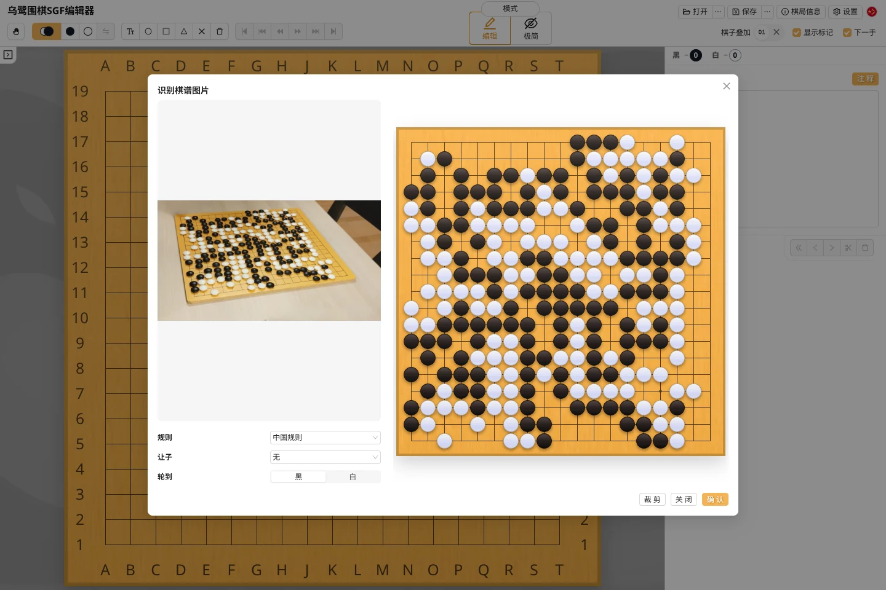
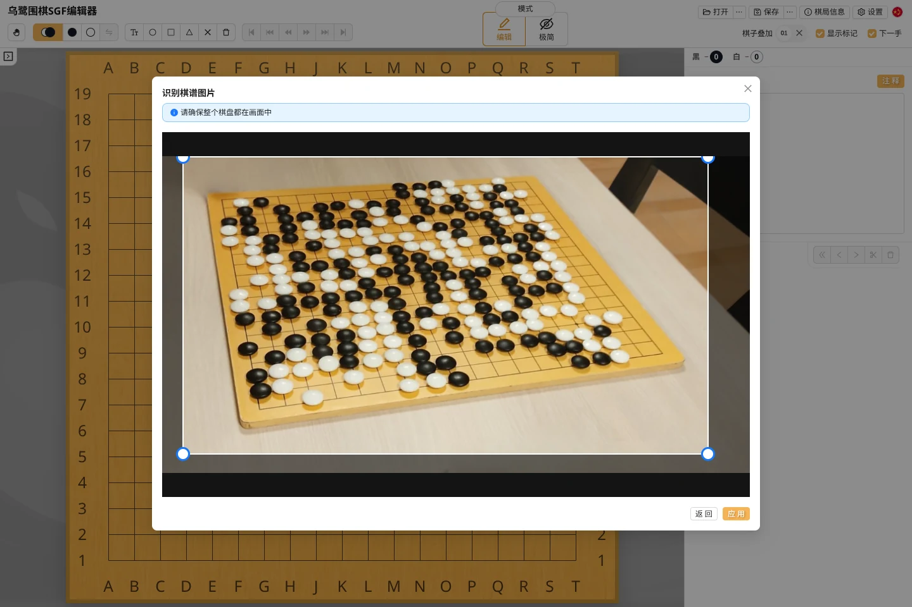
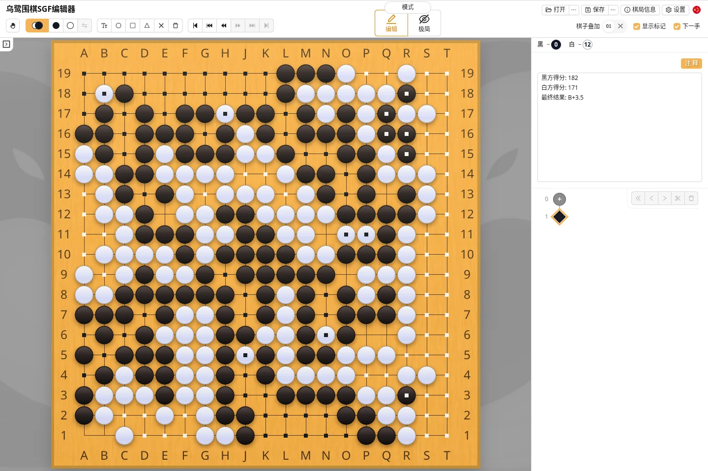
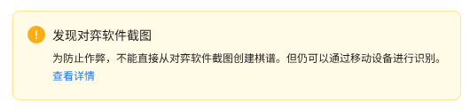

乌鹭围棋可以从棋盘照片中识别黑白棋子，用来**快速录入盘面**，也可以在对局结束后**拍照数子**。这些操作都可以在网页版完成；数子不依赖桌面版AI。

单张照片只能记录**当前盘面**，不能还原此前的落子顺序或提子过程。

### 快速开始

1. 在 [ulugo.com](https://ulugo.com) 打开图片；手机也可以直接选择“从相机打开”。
2. 选择 `9 × 9`、`13 × 13` 或 `19 × 19`，必要时裁剪图片。
3. 点击“应用”，对照原图检查识别结果。
4. 选择规则并确认，即可保存棋谱或查看数子结果。

### 拍摄一张容易识别的照片

| 推荐 | 尽量避免 |
| --- | --- |
| 完整拍到棋盘四边和四角 | 棋盘边缘被裁掉或被物体遮挡 |
| 从棋盘正上方或接近正上方拍摄 | 角度过低，棋盘透视变形严重 |
| 光线均匀，黑白棋子边界清楚 | 棋子上有强烈反光或大片阴影 |
| 画面清晰，棋盘占据主要区域 | 模糊、遮挡，或棋盘在照片中太小 |

### 裁剪

如果棋盘在照片中较小，或者周围背景复杂，可以先裁剪。只需注意：

- 保留棋盘的四条边和四个角；
- 哪怕最外侧一路没有棋子，也不要让裁剪框紧贴最外侧棋盘线。

### 盘后拍照数子

对局结束后，用手机打开 [ulugo.com](https://ulugo.com)，拍下完整棋盘并完成识别，就可以直接查看数子结果。数子在浏览器中完成。

- 选择与对局一致的规则；
- 对照照片检查是否有错子、漏子；
- 如有需要，点击棋盘上的死子进行调整。

### 公平使用与对弈软件截图 {#screenshot}

乌鹭希望图像识别用于实体棋盘录谱、盘后数子和赛后复盘。为了维护在线对弈的公平性，桌面环境会识别常见的对弈软件截图，并暂停从这类图片直接创建棋谱。

这项机制不会判断使用者的动机，只是为可能影响实时对局的场景增加一道轻量限制。

对于在线对局的赛后复盘，如果不方便下载棋谱，只能拍照，可以在移动设备上使用 [ulugo.com](https://ulugo.com) 识别并导出 SGF。移动设备上的乌鹭围棋不会进行截图检测。

### 隐私与问题反馈

图片识别在你的设备上完成。选择的图片不会上传到任何服务器，我们也不会收集这些图片或将其用于任何模型训练。

如果识别结果有明显问题，欢迎在 [GitHub Issues](https://github.com/rinick/ulugo/issues/new) 中反馈，并由你自行决定是否附上原图。
